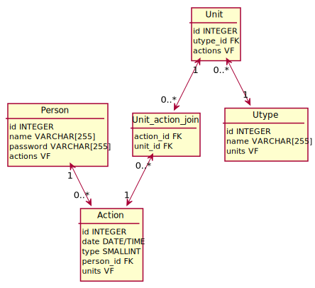

# Listore, a data storage exercise

## Documentation :
### The Entity relationship diagram of the current database

---

### A use case diagram of an example of a client implementation of the basic use cases of the Listore server app

---

### Endpoint documentation can be found in [documentation/json_endpoints](https://github.com/hugo-blanchard/listore/tree/main/documentation/json_endpoints)
